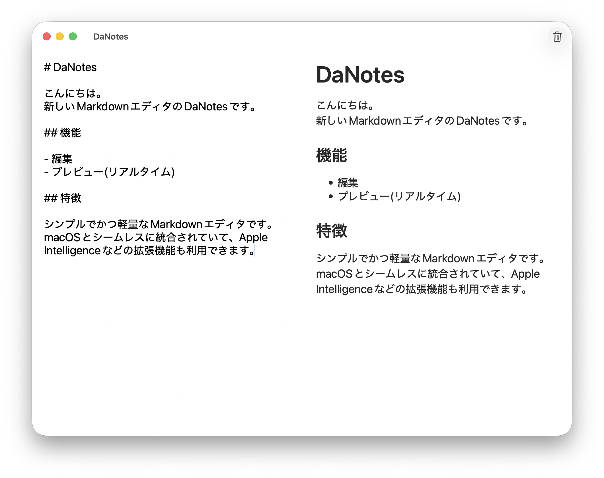

# DaNotes

English version: [README_en.md](./README_en.md)


DaNotesは、SwiftUIで作られたMac用のMarkdownリアルタイムエディタアプリです。  
左側のテキストエディタで入力したMarkdownテキストが、右側にリアルタイムでプレビューされます。

## 特徴

- **リアルタイムプレビュー**: 左側のエディタで入力したMarkdownテキストが、右側に即座にレンダリングされます
- **データ永続化**: 入力したテキストは自動的に保存され、アプリを再起動しても内容が保持されます
- **クリア機能**: ツールバーのゴミ箱ボタンまたはCmd+Deleteキーでテキストをクリアできます
- **美しいUI**: macOSのネイティブデザインに合わせたクリーンなインターフェース

## 技術仕様

- **開発言語**: Swift
- **フレームワーク**: SwiftUI
- **対応OS**: macOS 26 以降
- **外部ライブラリ**:
  - [swift-markdown-ui](https://github.com/gonzalezreal/swift-markdown-ui) - Markdownレンダリング

## スクリーンショット



アプリは左右分割されたレイアウトで：

- 左側: テキストエディタ（Markdown入力）
- 右側: プレビューエリア（レンダリング結果）

## 使用方法

1. アプリを起動する
2. 左側のエディタにMarkdownテキストを入力する
3. 右側で即座にプレビューが確認できる
4. テキストをクリアしたい場合は、ツールバーのゴミ箱ボタンをクリックするか、Cmd+Deleteキーを押す

## ビルド方法

### 必要な環境

- Xcode 26 以降
- macOS 26 以降

### ビルド手順

1. このリポジトリをクローンする:

```bash
git clone https://github.com/renorari/DaNotes.git
cd DaNotes
```

1. Xcodeで `DaNotes.xcodeproj` を開く

1. プロジェクトをビルドして実行する（Cmd+R）

## 開発者

作成者: Renorari  
作成日: 2025年7月3日

## ライセンス

このプロジェクトはGNU GENERAL PUBLIC LICENSE Version 3の下でライセンスされています。  
詳細は [LICENCE](./LICENCE) ファイルを参照してください。

## 貢献

バグレポートや機能要求は、GitHubのIssuesページでお願いします。
